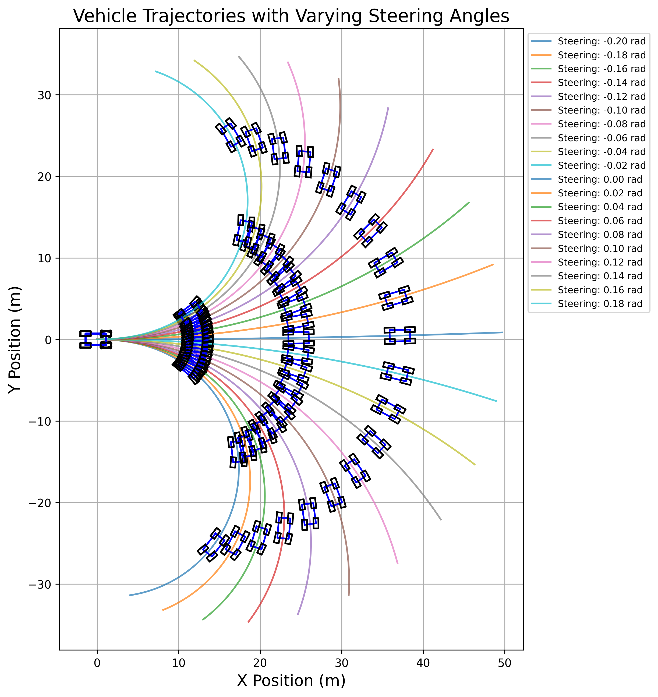

# SlipJAX

A JAX-based implementation of vehicle dynamics models from "Dynamics And Control Of Drifting In Automobiles" (Hindiyeh, 2013), ported from MATLAB.



## Overview

SlipJAX is a Python package that translates MATLAB vehicle dynamics models to JAX-compatible Python code. The implementation leverages JAX for GPU acceleration, automatic differentiation, and JIT compilation benefits while maintaining the mathematical accuracy of the original models.

## Features

- **JAX Compatibility**: All computations are JAX-compatible, allowing for GPU acceleration and automatic differentiation
- **JIT Compilation**: Model functions are decorated with `@jit` for faster execution
- **Modular Architecture**: Well-structured package organization for better maintainability and extensibility
- **Object-Oriented Design**: Class-based API for a more modern and flexible interface
- **Legacy Compatibility**: Maintained backward compatibility with pure functional API
- **Type Annotations**: Comprehensive type hints using JAX-specific types
- **Batch Processing**: Models support batch processing of multiple vehicle states simultaneously

## Project Structure

```
slipjax/
├── models/
│   ├── tire/
│   │   ├── base.py     # Base tire dynamics class
│   │   ├── front.py    # Front tire dynamics model
│   │   └── rear.py     # Rear tire dynamics model
│   └── vehicle/
│       └── dynamics.py # Vehicle dynamics model
├── config/
│   └── parameters.py   # Vehicle parameters
└── utils/
    └── jax_utils.py    # JAX-specific utilities
```

## Models Implemented

- **Front Tire Dynamics**: Calculates lateral force for the front tire based on slip angle
- **Rear Tire Dynamics**: Calculates longitudinal and lateral forces for the rear tire based on multiple parameters
- **Vehicle Dynamics**: Full vehicle model that integrates tire forces to simulate vehicle motion

## Installation

```bash
pip install slipjax
```

For development:

```bash
git clone https://github.com/yourusername/slipjax.git
cd slipjax
pip install -e ".[dev]"
```

## Quick Start

### Class-Based API (Recommended)

```python
import jax.numpy as jnp
from slipjax.models.tire.front import FrontTireDynamics
from slipjax.models.tire.rear import RearTireDynamics
from slipjax.models.vehicle.dynamics import VehicleDynamics
from slipjax.config.parameters import VehicleParameters

# Front tire example
front_tire = FrontTireDynamics(cornering_stiffness=jnp.array(50000.0))

slip_angle = jnp.array(0.1)  # radians
longitudinal_slip = jnp.array(0.0)  # no longitudinal slip for front tire
front_load = jnp.array(3000.0)  # Newtons
friction_coefficient = jnp.array(0.7)

lateral_force = front_tire(slip_angle, longitudinal_slip, front_load, friction_coefficient)

# Rear tire example
rear_tire = RearTireDynamics(
    cornering_stiffness=jnp.array(45000.0),
    longitudinal_stiffness=jnp.array(40000.0)
)

longitudinal_velocity = jnp.array(10.0)  # m/s
wheel_velocity = jnp.array(11.0)  # m/s
slip_angle = jnp.array(0.05)  # radians
friction_coefficient = jnp.array(0.7)
sliding_friction_coefficient = jnp.array(0.5)
rear_load = jnp.array(3500.0)  # Newtons

longitudinal_force, lateral_force = rear_tire.calculate_forces(
    longitudinal_velocity,
    wheel_velocity,
    slip_angle,
    friction_coefficient,
    sliding_friction_coefficient,
    rear_load
)

# Full vehicle dynamics example
vehicle_params = VehicleParameters(
    mass=jnp.array(1500.0),  # kg
    moment_of_inertia=jnp.array(3000.0),  # kg*m^2
    front_axle_distance=jnp.array(1.2),  # m
    rear_axle_distance=jnp.array(1.4),  # m
    cornering_stiffness=jnp.array(45000.0),  # N/rad
    longitudinal_stiffness=jnp.array(40000.0),  # N/unit slip
    friction_coefficient=jnp.array(0.7),
    sliding_friction_coefficient=jnp.array(0.5),
    front_tire_load=jnp.array(3000.0),  # N
    rear_tire_load=jnp.array(3500.0),  # N
    velocity_damping=jnp.array(0.1),
    yaw_damping=jnp.array(0.1)
)

vehicle = VehicleDynamics(vehicle_params=vehicle_params)

# State: [x, y, yaw, vx, vy, yaw_rate]
state = jnp.array([0.0, 0.0, 0.0, 10.0, 0.0, 0.0])

# Control input: [wheel_speed, steering_angle]
control_input = jnp.array([11.0, 0.1])

# Calculate state derivatives
state_derivatives = vehicle.calculate_derivatives(state, control_input)
```

### Legacy API (For backward compatibility)

```python
import jax.numpy as jnp
from slipjax.models.tire.front import calculate_front_tire_lateral_force
from slipjax.models.tire.rear import calculate_rear_tire_forces
from slipjax.models.vehicle.dynamics import calculate_vehicle_dynamics
from slipjax.config.parameters import VehicleParameters

# Front tire example
slip_angle = jnp.array(0.1)  # radians
friction_coefficient = jnp.array(0.7)
front_load = jnp.array(3000.0)  # Newtons
cornering_stiffness = jnp.array(50000.0)  # N/rad

lateral_force = calculate_front_tire_lateral_force(
    slip_angle, 
    friction_coefficient, 
    front_load, 
    cornering_stiffness
)

# Rear tire example
longitudinal_velocity = jnp.array(10.0)  # m/s
wheel_velocity = jnp.array(11.0)  # m/s
slip_angle = jnp.array(0.05)  # radians
friction_coefficient = jnp.array(0.7)
sliding_friction_coefficient = jnp.array(0.5)
rear_load = jnp.array(3500.0)  # Newtons
longitudinal_stiffness = jnp.array(40000.0)  # N/unit slip
cornering_stiffness = jnp.array(45000.0)  # N/rad

longitudinal_force, lateral_force = calculate_rear_tire_forces(
    longitudinal_velocity,
    wheel_velocity,
    slip_angle,
    friction_coefficient,
    sliding_friction_coefficient,
    rear_load,
    longitudinal_stiffness,
    cornering_stiffness
)
```
```

## Model Details

The vehicle dynamics models are based on the mathematical formulations presented in "Dynamics And Control Of Drifting In Automobiles" (Hindiyeh, 2013). The models calculate forces based on:

- **Slip Angle**: Angle between tire's heading and actual direction of travel
- **Longitudinal Slip**: Ratio of wheel velocity to vehicle velocity
- **Friction Models**: Including linear and saturation regions
- **Tire Stiffness Properties**: Cornering and longitudinal stiffness parameters

### JAX Compatibility

All models are designed to work with JAX's Just-In-Time (JIT) compilation for maximum performance. Special care has been taken to handle JAX tracing and compilation requirements:

- Using custom conditional utilities to replace Python's if/else statements
- Handling special cases like division by zero in a JIT-compatible way
- Ensuring all operations are compatible with JAX's autodiff

For detailed model documentation, see the [dynamics documentation](docs/dynamics.md).

## Development

### Testing

```bash
pytest
```

Tests are organized to mirror the package structure and include comprehensive tests for each component.

### Code Formatting

```bash
black slipjax tests
isort slipjax tests
```

### Type Checking

```bash
mypy slipjax
```

### Adding New Models

To add a new tire or vehicle dynamics model:

1. Create a new file in the appropriate directory (`models/tire/` or `models/vehicle/`)
2. Implement the model as a class inheriting from the appropriate base class
3. Add JIT-compatible methods for the core functionality
4. Include legacy functions for backward compatibility if needed
5. Write comprehensive tests in the corresponding test directory

## License

MIT License

## Citation

If you use SlipJAX in your research, please cite:

```
@software{slipjax2023,
  author = {Your Name},
  title = {SlipJAX: JAX-based Vehicle Dynamics Models},
  year = {2023},
  url = {https://github.com/yourusername/slipjax}
}
```

Original MATLAB model:
```
@phdthesis{hindiyeh2013dynamics,
  title={Dynamics and control of drifting in automobiles},
  author={Hindiyeh, Rami Y},
  year={2013},
  school={Stanford University}
}
```